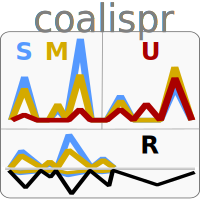
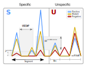

# COALISPR

A collection of [Python][py] command-line scripts for quick, selective counting and visualisation of high throughput (small RNA) sequencing data.

**Coalispr** - *CO*unt *ALI*gned *SP*ecified *R*eads - relies on [Pandas][pd], [Numpy][np], [Pysam][ps] and [Matplotlib][mpl]. Retrieval of read counts is fairly fast when bam files with alignments of *collapsed* sequences, obtained with [pyCRAC][pC], are parsed. [Seaborn][sea] is used for presenting count-data.

The input for **Coalispr** are bedgraph files. Bedgraphs show the frequency by which high-throughput sequencing reads are aligned to genome locations. Usually, these alignments are saved in bam files and converted to bedgraph data for visual analysis in a genome browser ([IGB], [IGV], [Ensembl](https://www.ensembl.org)). This collection of scripts compares bedgraphs to classify reads which are then selected from bam files by their coordinates and counted.

## *Bio*-informatics: clear up messy data with negative controls
This package has been developed for the analysis of small RNA datasets obtained by sequencing size-selected cDNA libraries produced from co-purified or total RNA samples.

The presence of unspecific signals, which vary per experiment, forms a major hindrance to systematic analysis of small RNA datasets. On top of that, the counting of reads that represent genuine siRNAs can be problematic. For protein coding messenger RNAs (mRNA) read counts are usually obtained by reference to known features described in a GTF file. GTFs tend to poorly annotate (uncommon) non-coding RNAs or mRNAs that appear unproductive (i.e. come from a predicted pseudo-gene); often these are ignored, especially when they derive from a repeated locus in a genome. Thus, most GTFs are no help in identifying siRNAs and their targets, often transposon-linked transcripts.

**Coalispr** only uses genomic coordinates, not features, for counting. The program relies on data from *mock* experiments to distinguish specific from unspecific signals, applying a standard experimental heuristic to bioinformatic analysis:

>The overall idea behind this application is that the output of negative biological controls is common to all samples, and relate to the kind of experimental methods used. These negative controls show which part of the experimental output is not informative. Therefore, removing this unspecific output from all samples gives signals that are specific, both for the positive and for mutant samples. **Coalispr** systemises this clearing up into a traceable and transparent procedure; it embraces the *bio* in bioinformatics.

Essential for biological experiments are the 'positive' and 'negative' controls. The 'negative' control is a sample that is not expected to provide an informative answer; a negative control shows the noise in the experiment. In contrast, a 'positive control' should give output that is specific, i.e. adheres to the current knowledge available for the biological system under study. It tells that the experimental conditions produced a useful answer. To assess the effect of a mutation is to check what happens to the specific output (relative to that of the controls).

## Comparing bedgraphs
Bedgraphs are simple tables with read-count values for chromosomal positions. A framework like [Pandas][pd] is ideal to assess and vectorize such data. File sizes loaded into the program are reduced at various stages. This combination speeds **Coalispr** up.

- Reads are collected by their mid-point in genomic regions of a settable size with their values summed over each bin. A common index enables direct comparison of bedgraph values between different samples.
- Comparisons are done per chromosome (they differ in length) and for each strand separately.
- Intermediate outputs are stored as pickle files and used for
- Interactive visualization by means of [Matplotlib][mpl].
- Boundaries of contiguous regions with either unspecific or specific reads are mapped and stored in tsv files.
- Retrieval of reads from coordinate-sorted bam files with [Pysam][ps] is on the basis of these segment-definitions. This round gathers the counts and other characteristics of mapped reads and saves these in tsv files.

A major time-gain is obtained by using the [pyCRAC][pC] package for collapsing reads before alignment. The `pyFastqDuplicateRemover.py` in `pyCRAC.scripts` takes identical sequences together and stores their count in the name of their unique, collapsed representative.

Bam files with alignments of collapsed reads are more noisy (with single-mapped reads' bias) but still enable division between unspecific and specific segments and are much smaller. Having collapsed reads in the bam files speeds up the counting of aligned reads (one of the major bottlenecks in this kind of analysis) enormously. The default is to take a mixed approach: segment boundaries collected from bedgraphs based on aligned uncollapsed reads are determined. Then, with these boundaries, collapsed reads are retrieved for fast counting, which results in outputs that reproduce the original read counts.

After obtaining the counts, comparison to a features file can be done by means of the segment boundaries. The program comes with a collection of scripts to visualize various aspects of the sequencing libraries that are analyzed.

## Setup and Install
The source for this project is available [here](coalispr). Please see [the docs](https://coalispr.codeberg.page/) for more information.

The scripts rely on
- an experiment-file, which is a  tabbed file describing the experiments (for example [exp_label_names.tab](coalispr/resources/experiment_table.tsv)).
- a configuration-file with settings and constants, `constant.py`, needed for parsing the experiment-file and running the program.

This package is best installed locally in user space, not system wide, or in a virtual environment (with Python sources in 'env/'). Then, any code file is adaptable, while altered or added scripts can be directly run without re-installation. For local installation, after extraction of the source archive (`tar -xvzf <archive.tgz>`), go to the project folder with the `setup.py` file and run in a terminal (as user):
`python3 -m pip install --editable . ` (Note the single dot, it stands for 'current directory'). A script callable from the command line, `coalispr`, will be installed in the home folder (~/.local/bin/coalispr) or in the virtual environment install folder (env/bin/coalispr).
(alternatively, run `python3 -m coalispr` instead of `coalispr`)

**Coalispr** has various commands with multiple options. The 'help' command `coalispr -h` provides an overview.

Use the command `coalispr init` to set up the work environment and name the session/experiment. Text files (shipped in [`coalispr.resources.constant_in`](coalispr/resources/constant_in)) that form `constant.py`, are copied to a `config` folder. The session-specific configuration file needs to be edited in order to get a usable `constant.py`, which is generated via the command: `coalispr setexp`.

## Configuration settings
Negative data in high-throughput sequencing are reads with shared mapping positions and comparable peak intensities that are common to all samples. **Coalispr** extracts these reads from the data using the negative controls as reference. The procedure to specify reads as either *'specific'* or *'unspecific'* is guided by particular configuration settings: UNSPECLOG10 (sets a threshold for reads with some overlap to reads in the negative control), LOG2BG and USEGAP, for demarcation of read segments (clusters with contiguous reads). Obvious peaks shared by all samples could indicate a ncRNA.

## Licence
The project is licensed under the European Union Public Licence ([EUPL])

## Background
The developer has been a wet-scientist whose aim was to complement visual analysis of siRNA datasets in a genome browser with a computational approach, allowing for a systematic comparison of a large number of datasets in one go, including negative controls.

Development of the application was triggered after reviewing a meta-analysis of sequencing data linked to Argonaute proteins. The bioinformatic outcomes were highly suspicious, i.e. that could be the product of analyzing 'negative' data. Therefore, it was alarming that negative controls when available in the data-sets had not been checked for relevant overlap with the (positive) data the main conclusions were based on. The aim of **Coalispr** is to make this overlap explicit and thereby identify reads that can be genuinely informative. When bioinformatics loses sight of *bio* it easily becomes a propagator of fake news.

[py]: https://www.python.org/
[pd]: https://pypi.org/project/pandas/
[np]: https://pypi.org/project/numpy/
[mpl]: https://pypi.org/project/matplotlib/
[ps]: https://pypi.org/project/pysam/
[pC]: https://pypi.org/project/pyCRAC/
[sea]: https://pypi.org/project/seaborn/
[IGB]: https://bioviz.org
[IGV]: https://igv.org
[EUPL]: https://opensource.org/licenses/EUPL-1.2
