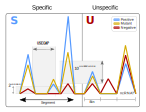

.. include:: /properties.rst


Tutorials
=========


Files and commands
------------------

|prgnam| is run from a terminal, known as the "command line" [#cmdl]_, familiar to users of \*nix operating systems.
Commands run in the terminal are indicated as ``command`` in the text. Note, that ``Names for files`` are referenced like commands; hopefully the context will make clear whether a command or file name is meant. :smc:`NOUNS` (in small capitals, in bold) will refer to constants used by |prgnam| as explained in the :doc:`How-to guides</howtoguides>`.

For each tutorial, all data, including a collection of scripts and files, will be saved at one place. All scripts will have to be run from within this work directory; in a terminal do: ``cd <path to work directory>``. To see what the scripts do, open them in a text :ref:`editor <editrs>`.

.. _editrs:
   
Edit all files in an editor that saves plain text files (without introducing extra formatting) like Gvim_, Nano_, Pico_, Emacs_, Joe_, Vi_ (or Vim_), SciTE_, Mousepad_, etc. or use ``F4`` on the file from within the file-browser Mc_ (midnight commander). 

For downloading the data, the SRA-Toolkit_ needs to be installed on the system.

Programs required for processing sequence data in the tutorials are Flexbar_, STAR_, and Samtools_; to check quality of alignments (optional), Fastqc_, or RSeQC_ are needed. Some programs can be run multi-threaded; scripts are set to use four threads in parallel: trimming with ``flexbar -n 4``; alignment with ``STAR --runThreadN 4``, and ``samtools sort -@ 4``. These settings can be changed by editing the scripts.

The tutorials run through a sequence of bash_ or Python_ scripts [#expl]_, the order of which will be clear from the numbering of the script names. These scripts and other files will have to be copied from the |prgnam| distribution to the work directory. Further, required :term:`fasta` and annotation files for a genome will have to be downloaded to the work directory as well. Unless specifically prepared for use with |prgnam| these files are not shipped with the program.

For programs |prgnam| directly relies on, see :doc:`/README`.

To reset |prgnam| when configuration is not working, run  ``python3 -m coalispr.resources.constant_in.make_constant``.

.. Note::

        All instructions are made with wet-scientists in mind. The coding has been kept quite simple and done pragmatically, it worked at the developer's end (error-checks in the scripts have also been inspired on experience). Further, things can change: for example, a more recent version-number in a file name could cause a script to stall. Error messages [#errs]_ will provide insight into the problem and could indicate how the scripts can be repaired. Scripts can easily be adapted in a :ref:`plain-text editor <editrs>`. 

        In general, the instructions and coding will not be perfect. Please provide feedback at the |prgnam| repository at codeberg.org_ whith suggestions how these can be improved. Thanks.


|

Generating bedgraphs
--------------------

|prgnam| has been tested on the data sets described in these tutorials.

Before the program can be used, we have to generate :term:`bedgraph` files; these are needed for input. Sometimes sequence data have been deposited as bedgraphs but because some of the requirements (like the use of :term:`collapsed` data for counting and defining detection of :term:`introns <mRNA>` during STAR_ alignment or how :term:`multimapper`\ s are counted) we will generate alignments of raw reads first (an essential step for analysing :term:`RNA-Seq` data with |prgnam|). 

Starting from raw reads, adapters and barcoded linkers are removed [#stringentmap]_ and then the reads are mapped to a reference genome. For read-alignment we have been using STAR_, basically because:

- STAR_ aligns :term:`fasta` and :term:`fastq` sequence formats.
- can deal with spliced introns [#spl]_.
- allows for defining how multi-mapping reads will be counted (important for siRNAs linked to repeated loci like transposons).
- can be set not to clip reads and obtain a match end-to-end (relevant for size-restricted fragments that can be expected for siRNAs).
- makes it easy to generate bedgraph files from the obtained :term:`bam` files with read alignments.
- is fast.

The STAR_ output is sorted (by means of scripts) or inspected from the command line with samtools_. 

Two sets of bam and bedgraph files are constructed. For one set, :term:`uncollapsed` reads are used (i.e. the fastq sequencing files); for the other, reads of the fastq sequencing files are first :term:`collapsed` before they are mapped to the genome. For collapsing the ``pyFastqDuplicateRemover.py`` from the pyCRAC_ suite is used. The alignment files with collapsed reads form the input for the counting of reads by ``coalispr countbams``.


Example data
````````````
To provide the ability to test |prgnam| on alignments described in the tutorials ':doc:`/tutorials/mouse`\ ' and ':doc:`/tutorials/h99`\ ', input data can be downloaded from zenodo.org as ``tar.gz`` archives. To extract the archives in a dictionary of choice:

- ``cd <path to chosen dictionary>``
- ``tar -xvzf <path to folder with downloaded archive>/<archive name>.tar.gz``

An archive ``<archive name>.tar.gz`` expands to a folder ``<archive name>`` in the chosen directory. The archives include an example configuration file ``<archive name>/Coalispr/config/constant_in/3_<experiment name>_zenodo.txt`` as well as pre-processed bedgraphs in text format (:smc:`TSV`), in ``<archive name>/Coalispr/data/<experiment name>/backup_from_pickled_zenodo/``. A shortcut ``backup_from_pickled`` facilitates to produce binary data files (in :term:`pickle <pkl>` format) from the shipped text files (as discussed in ':doc:`/tutorials/mouse`\ ' and ':doc:`/tutorials/h99`\ ').

|

Specifying reads
----------------

Bedgraph values provide an indication of relative abundance of reads in the RNA sample and can be used for :term:`specifying <specified>` reads as :term:`specific` or :term:`unspecific`. The two types of reads mainly differ in mapping positions, while, in the case of an overlap, specific reads are, relative to unspecific ones, far more abundant. Even when overall read-numbers vary largely between libraries, the relative bedgraph values can be used for this categorization, as explained below. 

In our experience, due to the PCR-amplification steps in library preparation and sequencing protocols, all samples produce significant numbers of reads, even in the case of :term:`negative control`\ s that, theoretically would not yield relevant information. RNA molecules from these negative samples are a random set with length-differences and not visualized as a particular RNA population (like a band on a gel/blot) but form an insignificant-looking background smear (for example shown in :ref:`Sarshad-2018 <sarshad3d_mouse>`). Still, significant numbers of reads derived from these 'smear' RNAs will be present in all libraries, especially when little or no :term:`positive <positive control>` RNA was present. Many of these reads represent fragmented forms of very abundant RNAs like rRNA, or tRNA, that normally are much longer. These fragments are found in samples of size-selected RNAs or turn up after RNA-immunoprecipitation, presumably by non-specific carry-over when these molecules stick to beads, tubes or other materials used in the procedure. Even if experimental contamination can be evaded, one cannot say beforehand whether these common fragments are representing intermediates in a biological significant route or are merely degradation products.




   The procedure to specify reads as either :term:`specific` or :term:`unspecific` is guided by particular configuration settings: :smc:`UNSPECLOG10` (sets a threshold for reads with some overlap to reads in the negative control), :smc:`LOG2BG` and :smc:`USEGAP` (for demarcation of read segments (clusters with contiguous reads). Obvious peaks shared by all samples could indicate a ncRNA.


|prgnam| treats the smear of background reads as :term:`unspecific` and identifies these by their presence in libraries of :term:`negative control` samples. In a negative control, the biological system under study (for example RNAi) has been disrupted (say by inactivation of Argonaute proteins) and any RNA molecule normally associated with this system (miRNAs, piRNAs, siRNAs) would not be available for sequencing. Apart from reads representing the common smear, libraries of :term:`positive control` samples, where the biological system is active, contain :term:`specific` reads derived from RNA molecules tightly linked to the studied system. These RNAs will form alignment peaks after mapping that stand out from the coverage profile of negative control samples.

Bedgraph values are expressed as :term:`RPM`, a kind of base-rate [Kahneman-2011]_, in reference to the total of mapped reads. When derived from alignment files, these totals of mapped reads contain various amounts of :term:`unspecific` reads and therefore cannot be used for comparing counts of specific peaks between samples directly. For this to be workable, all libraries should have been done at the same time, by the same person, with the same efficiency of purification and amplified in one reaction, which depends on available 5' linker-barcodes. 

When an internal standard is available, the RNA-levels (determined by read-counts) can be normalized to each other. Tools (e.g.  like DESeq2_ or EdgeR_) to analyse differential gene-expression tend to use a set of constant transcripts as the internal standard. This is applicable when detecting relative changes in protein-gene expression, that is of :term:`mRNA` levels (see :doc:`/background`\). For comparing :term:`siRNA` levels, quantitation of signals is :ref:`more complicated <siquant>` and found to be quite baffling to the author.

In the tutorials, analyses using |prgnam| of a mouse miRNA experiment, yeast CRAC-data and siRNA libraries for *Cryptococcus* are presented:

|

.. toctree::
   :maxdepth: 1


   tutorials/mouse
   tutorials/yeast
   tutorials/h99
   Oligonucleotides <tutorials/oligos_crac>

..   tutorials/jec21
   
   Epitopes <tutorials/epitopes>
   Oligonucleotides <tutorials/oligos>

   

     
=====

Notes
'''''

.. [#cmdl] A good introduction for use of the command line is given at linuxcommand.org_. To save on typing efforts: press ``arrow-up`` to go through a list of previous commands; or ``tab`` for word-extension.
.. [#expl] All .sh (bash_ scripts) and .py (Python_ code) files will carry explanatory remarks that (might) help to understand what they do.
.. [#errs] Error messages appear in the terminal ("standard out") or are written to the logfiles within the :smc:`EXP` folder in the ``<working environment>/Coalispr/logs/`` directory. Also see :doc:`/errors`.
.. [#stringentmap] Small RNAs that derive as breakdown products from longer molecules will  migrate along with siRNAs in the same portion of the gel. To enhance detection of siRNAs that possibly cover various exons (and thus bridge introns when mapping to a genome) it helps to remove all possible adapter sequences before mapping rather than using the hard- or soft-clipping functions provided by an aligner like STAR_. This clipping also removes non-matching ends of a read that could actually derive from a cDNA (aberrantly) formed during library preparation. For this reason supplementary reads or chimers, which can be mapped with STAR_ are ignored. Hybrids resulting from proximity ligation and detected after UV-cross linking [Kudla-2011]_ are better identified by specialized programs. The stringent 'end-to-end' setting used for mapping will reduce the read-count significantly resulting in a large fraction of unmapped reads. During counting of mapped reads, those with mismatches will be skipped that contain a number of substitutions exceeding a set minimum (:smc:`NRMISM`, default 0). Also insertions or deletions will not be tolerated, although point-deletions could be configured as acceptable (settings :smc:`CIGARCHK`, :smc:`CIGFM` and :smc:`CIGPD`).
.. [#spl] Essential in the case of *Cryptococcus (de)neoformans*. In these species, genes can have >5 introns ([Loftus-2005]_, [Janbon-2014]_, [Janbon-2018]_).
   


