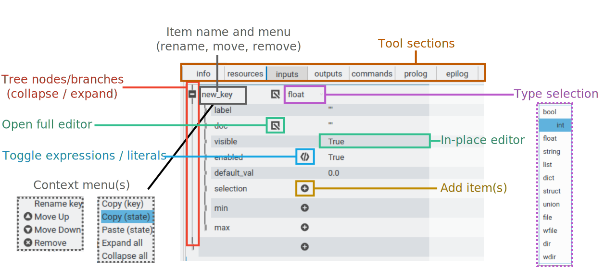

Graphical Editor
================

.. The Nano Workflow Language (NWL) is a specification for defining the steps used
.. to execute an overall workflow.
.. The definition itself is based on a subset of Yaml composed of the base types
.. boolean, integer, float, string, sequence, and mapping.
.. A `Tool` definition encapsulates one step in a workflow and is divided into three
.. primary sections: inputs, outputs, and commands.

.. The inputs section defines the structure and types for input variables to the
.. tool, and is used to validate the input values at run-time.
.. The inputs section may also be used to generate a graphical user interface
.. for creating and editing input files, such as in extensions built for the
.. Galaxy Simulation Builder.

The graphical editor for the Nano Workflow Language is available when the
package :mod:`partis-view` is installed, along with :mod:`partis-nwl`.

.. code:: bash

  pip install partis-nwl
  pip install partis-view
  partis-view

.. tab-set::

  .. tab-item:: New File (Ctrl+N)

    .. figure:: ./img/nwl_gui/new_file.png
      :figwidth: 60 %
      :align: center

  .. tab-item:: Select Editor (Up/Down)

    .. figure:: ./img/nwl_gui/select_editor.png
      :figwidth: 40 %
      :align: center

  .. tab-item:: Save (Ctrl+S)

    .. figure:: ./img/nwl_gui/save.png
      :figwidth: 60 %
      :align: center

.. note::
   Name your file as [name].yml and save it location ~/partis/src/partis-nwl/examples/ 

The editor for :term:`NWL Tool` (:class:`~partis.nwl.tool.Tool`) is a one-to-one
relation to the elements of the NWL specification, divided into seven sections:

* ``info`` (:mod:`partis.nwl.info`): user-friendly label, version, author, and documentation.
* ``resources`` (:mod:`partis.nwl.resources`): Computational capabilities,
  static data, and program requirements.
* ``inputs`` (:mod:`partis.nwl.inputs`): data schema for the input values.
* ``outputs`` (:mod:`partis.nwl.outputs`): data schema for the output values.
* ``commands`` (:mod:`partis.nwl.commands`): prepares and executes scripts or
  underlying program(s) to achieve the goal of the tool.
* ``prolog`` (:class:`partis.nwl.tool.Tool_prolog`): issue messages regarding the ``inputs`` as a whole.
* ``epilog`` (:class:`partis.nwl.tool.Tool_epilog`): issue messages regarding overall tool execution.

Each section is edited by selecting one of the dedicated tabs.
The overall structure of each section is composed of mappings,
sequences, and values represented in a graphical tree.
The tree has a row / column layout, with each row represents a branch
(mapping / sequence) or leaf (value) in the tree as shown in :numref:`schema_tree_edit`.

.. _schema_tree_edit:

  Elements of the graphical NWL tree editor.

The first column contains the tree branches and node names.
If the node itself is editable, such as renaming or moving the node, there
will be a drop-down menu available next to the name that is opened by clicking
the "down" arrow.
Nodes that have fixed names and locations will not have a menu.

.. tab-set::

  .. tab-item:: Add

    .. grid:: 2

      .. grid-item-card::  Struct Item

        .. figure:: ./img/nwl_gui/add_input.png
          :figwidth: 100 %
          :align: center

      .. grid-item-card::  Optionals

        .. figure:: ./img/nwl_gui/add_optional.png
          :figwidth: 100 %
          :align: center

  .. tab-item:: Rename

    .. grid:: 2

      .. grid-item-card::  Menu

        .. figure:: ./img/nwl_gui/rename_key.png
          :figwidth: 100 %
          :align: center

      .. grid-item-card::  Dialog

        .. figure:: ./img/nwl_gui/rename_key2.png
          :figwidth: 100 %
          :align: center

  .. tab-item:: Move

    .. figure:: ./img/nwl_gui/move_input.png
      :figwidth: 60 %
      :align: center

  .. tab-item:: Remove

    .. figure:: ./img/nwl_gui/remove_optional.png
      :figwidth: 60 %
      :align: center

Node values are edited either by clicking the right-most column on the same row
as the node to open an in-place editor, or, for large text, by clicking the
|edit_btn| button
in the second column to open an editor in a dedicated window.
Either editor may be closed with the ``Esc`` key, committing the changes.

If the value has the option of being the result of evaluating an expression, a
|script_btn| button will appear in the third column to convert the node from a literal value
editor to an expression editor (E.G. Python / Cheetah).
When a value has been converted to an expression the button will change color.
Clicking the |script_active_btn| button again will disable the expression editor
and convert the node back to a literal value.

If a node has more than one possible type specification (E.G. int, float, string, etc.),
then a drop-down combo will instead appear in the third column.
If a node may have a variable number of children, the last empty branch under
the node will have a |add_btn| button in the third column to add a new child node.
Move up |move_up_btn|, move down |move_down_btn|, removing |remove_btn|, or renaming the
children added this way may be done through the
drop-down menu next child's name.

Some nodes are optional, and by default do not have any defined value.
Optional values that do not currently have a value will have a "plus" button in
the third column that will define the value.
Optional values that have been defined may be removed from the drop-down menu
next to the node name in the first column.

Evaluated Expressions
---------------------

.. tab-set::

  .. tab-item:: Toggle

    .. figure:: ./img/nwl_gui/edit_expression.png
      :figwidth: 60 %
      :align: center

  .. tab-item:: Full

    .. grid:: 2

      .. grid-item-card::

        .. figure:: ./img/nwl_gui/edit_expression2.png
          :figwidth: 100 %
          :align: center

      .. grid-item-card::

        .. figure:: ./img/nwl_gui/edit_expression3.png
          :figwidth: 100 %
          :align: center

  .. tab-item:: In-place

    .. grid:: 2

      .. grid-item-card::

        .. figure:: ./img/nwl_gui/edit_expression4.png
          :figwidth: 100 %
          :align: center

      .. grid-item-card::

        .. figure:: ./img/nwl_gui/edit_expression5.png
          :figwidth: 100 %
          :align: center

.. |edit_btn| replace:: |edit_btn_light| \| |edit_btn_dark|

.. |script_btn| replace:: |script_btn_light| \| |script_btn_dark|

.. |script_active_btn_dark| image:: img/partis_view_themes/dark/images/icons/script_active.svg
  :width: 16
  :alt: Evaluated/literal button (dark theme)

.. |script_active_btn| replace:: |script_active_btn_light| \| |script_active_btn_dark|

.. |add_btn_light| image:: img/partis_view_themes/light/images/icons/add.svg
  :width: 16
  :alt: Add button (light theme)

.. |add_btn| replace:: |add_btn_light| \| |add_btn_dark|

.. |remove_btn| replace:: |remove_btn_light| \| |remove_btn_dark|

.. |move_up_btn| replace:: |move_up_btn_light| \| |move_up_btn_dark|

.. |move_down_btn| replace:: |move_down_btn_light| \| |move_down_btn_dark|
