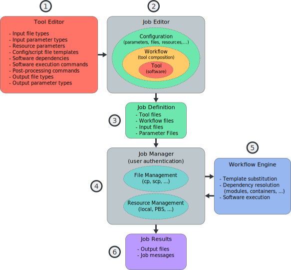

Nano Workflow Language (NWL) (:mod:`partis.nwl`)
================================================

Introduction
------------

The Nano Workflow Language (NWL) consists of a set of
:term:`JSON`-compatible schema
definitions and a run-time implementation that can be used to define and execute
general processing steps of an overall scientific simulation and analysis
workflow.

A natural question when considering a new software solution is if the problem
being solved already has a solution available, and, if there is, what is the
motivation to develop or adopt a one.
The essential components to be addressed are depicted in
:numref:`motivation_overview`:

1.  Guided creation and editing of new custom software tools
2.  Guided creation and editing of workflows between tools,
    and configuration of jobs
3.  Packaging of jobs into easily accessed and transferable formats
4.  Automated management of jobs to be submitted to HPC resources
5.  Automated execution of software tools and transfer of data between tool
    inputs/outputs and parameters in workflow
6.  Packaging of job results in easily accessed and transferable formats

.. _motivation_overview:

  Overview of essential components for workflow creation and execution

There are many software frameworks, domain specific language (DSL)
specifications, and utilities available that have similar goals as NWL.
Some examples of scientific oriented workflow software were
investigated and have influenced the development of different aspects of NWL:

.. _galaxy_project:

* Galaxy Project Framework :cite:`galaxyproject2018`

  * Open source project supported by “NSF, NHGRI, The Huck Institutes of the
    Life Sciences, The Institute for CyberScience at Penn State, and Johns
    Hopkins University”
  * Primarily used by bio-science analysis groups
  * https://galaxyproject.org/

.. _stellar_galaxy:

* Stellar Science Galaxy Simulation Builder/Coordinator :cite:`stellargalaxy2018`

  * Closed source software developed by Stellar Science
  * https://www.stellarscience.com/galaxy.html

    .. note::

      This software has a similar name, but is
      **not related to the above "Galaxy"**.

.. _commonwl:

* Common Workflow Language :cite:`cwl2021`

  * Open standard format for saving tool and workflow definitions
  * https://www.commonwl.org/

The development of NWL was motivated to address several specific needs for
the construction and execution of workflows:

* Flexibility in the method(s) used to run the developed tools

  * as a local stand-alone process.
  * as a job on an HPC cluster, such as with a
    `PBS <https://www.nas.nasa.gov/hecc/support/kb/Portable-Batch-System-PBS-Overview_126.html>`_
    based resource manager.
  * within other workflow software, such as
    :ref:`Stellar Science Galaxy <stellar_galaxy>`.

* Have input and output structure be standardized and non-ambiguous in order to

  * understand inputs and output results independent of the
    underlying program implementation.
  * easily compose tools ``outputs = g( f( inputs ) )``.
  * represent tool configuration graphically while minimizing the
    amount of GUI-specific information.

* Standardize embedded logging information and error conditions so that

  * the progress and status can be inspected independent of the
    underlying program implementation.
  * errors are logged consistently and thoroughly at all levels of the
    execution stack.

.. toctree::
  :maxdepth: 2
  :hidden:

  quickstart
  overview
  editor
  walkthrough
  citations
  glossary
  appendix
  src/index